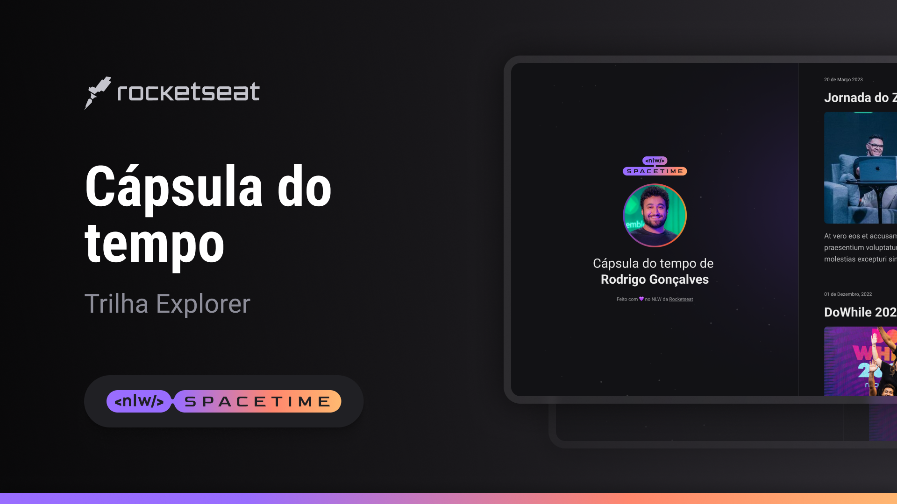

  

##  💻 Projeto

Esse é um projeto Web responsivo de uma cápsula do tempo para exibir memórias em uma linha do tempo

## 🚀 Tecnologias

Esse projeto foi desenvolvido durante o NLW da Rocketseat com as seguintes tecnologias:
- HTML
- CSS
- Git e Github

## 🏷️ Layout

Você pode usar o layout do projeto através [desse link](https://www.figma.com/file/4Hq9waMf8sGtSPaaOpmB9D/C%C3%A1psula-do-tempo-%E2%80%A2-Trilha-Explorer-(Community)-(Copy)?type=design&node-id=352%3A8&t=I8yN0XTX0FMieVxA-1).

É necessário ter uma conta no [Figma](https://www.figma.com)